# Звіт до роботи

## Тема
Агенти штучного інтелекту від Google ADK  

## Мета роботи
Навчитися створювати AI-агентів з використанням Google ADK (Python) та Poetry для управління залежностями проєкту  

---

## Виконання роботи  

### Результати виконання завдання 1...N  

### 1. Підготовка середовища
- Встановлено Python та Poetry  
- Перевірено версії:

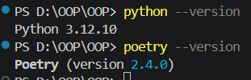
Отримано API ключ через Google AI Studio
Створено файл .env для збереження ключа
Додано .env у .gitignore для безпеки
###  2. Ініціалізація проєкту
poetry init
poetry add google-adk python-dotenv
requires-python = ">=3.12,6,<4.0"
Згенеровано файл poetry.lock
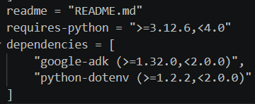
📌 poetry.lock фіксує точні версії залежностей

### 3. Перевірка ADK
poetry run adk --version
poetry run adk --help

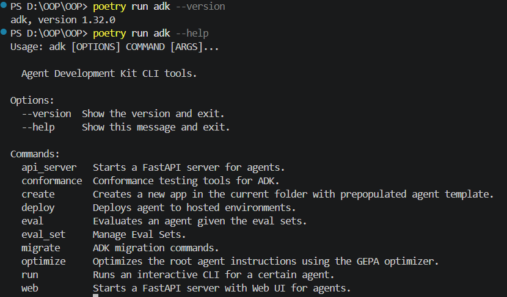
Основні команди:

create
run
web
### 4. Створення агента
poetry run adk create my_first_agent
Структура:

my_first_agent/
├── agent.py
├── .env
└── __init__.py
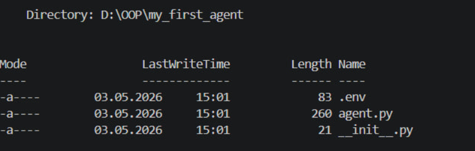
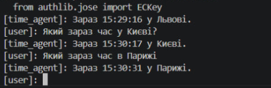

### 5. Математичний агент
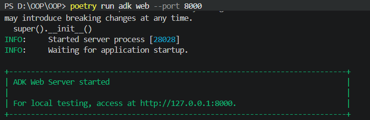
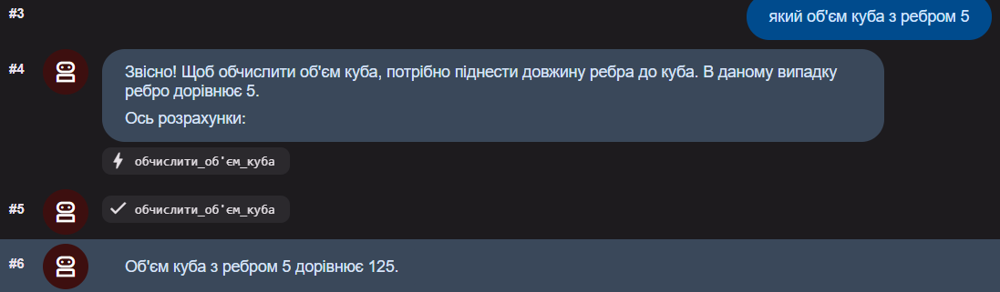
### 6. Агент-помічник
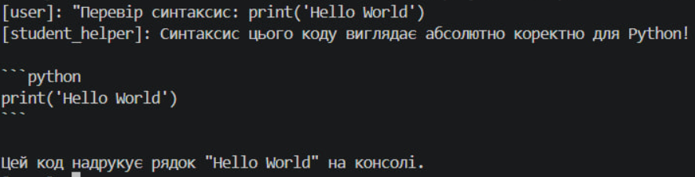
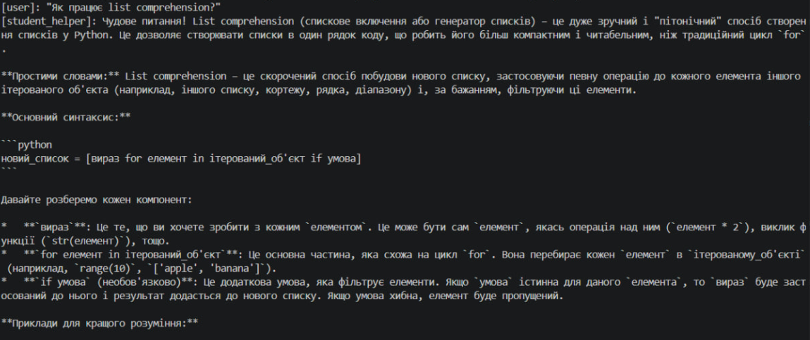

### 7. Креативний агент
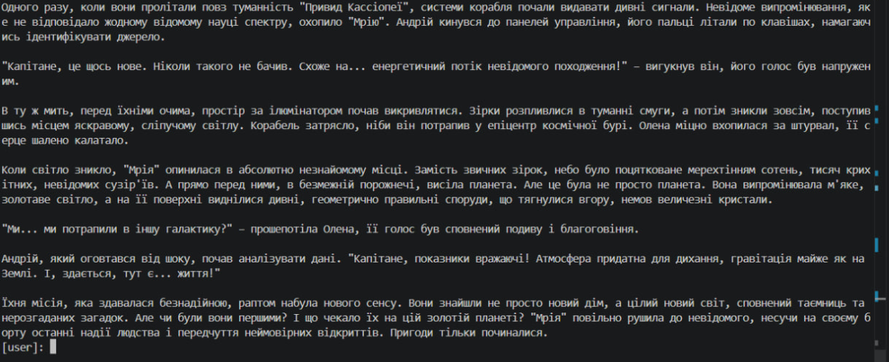
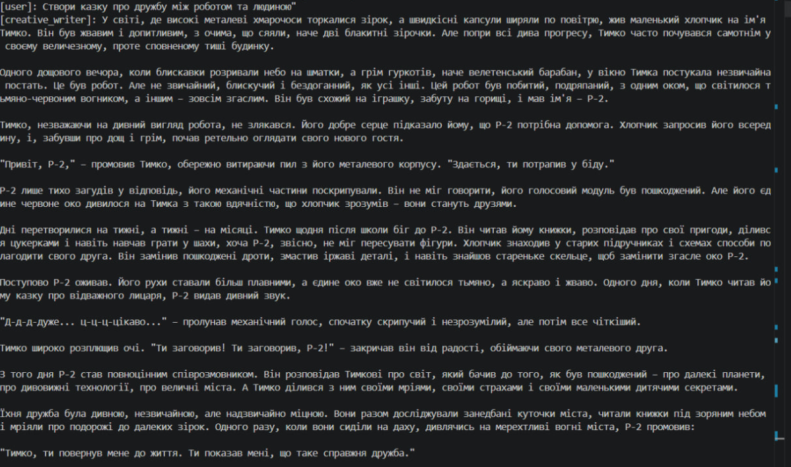

### 8. Температурний агент

### 8. Агент з пам’яттю
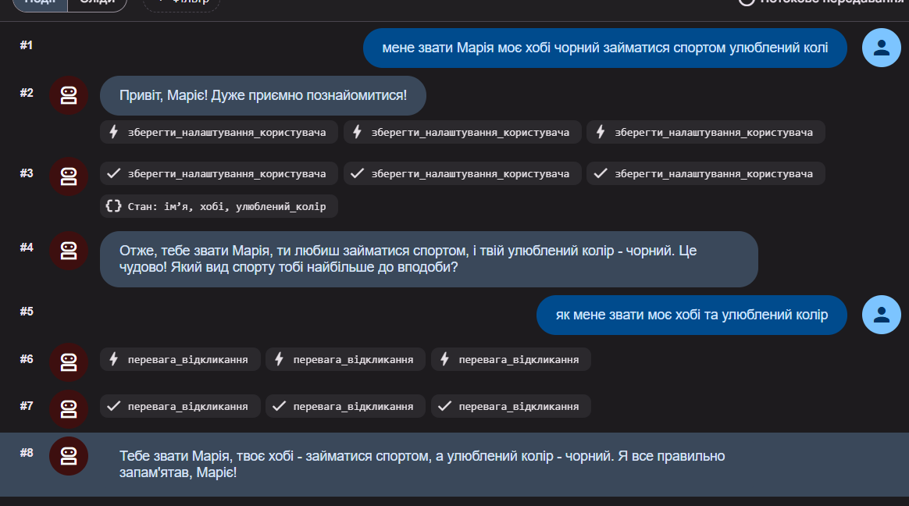

### 9. Структура
notes/06_python_agents/
├── my_first_agent/
├── math_agent/
├── student_helper/
├── tools/
├── pyproject.toml
├── poetry.lock
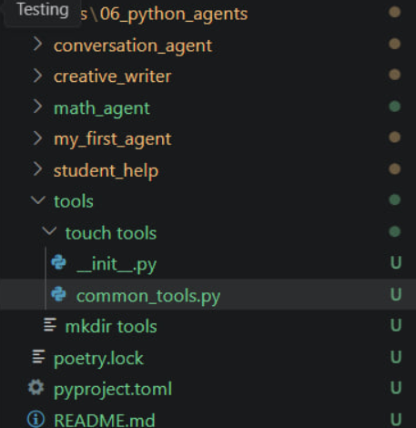

### 10. Власний агент

from google.adk.agents.llm_agent import Agent

# 🔹 Інструмент: безпечне ділення
def safe_divide(a: float, b: float) -> dict:
    """
    Ділить два числа з перевіркою на нуль.

    Args:
        a: перше число
        b: друге число

    Returns:
        dict: результат або помилка
    """
    if b == 0:
        return {"error": "Ділення на нуль неможливе", "result": None}
    return {"result": a / b, "error": None}

# 🔹 Інструмент: підрахунок слів
def count_words(text: str) -> dict:
    """
    Підраховує кількість слів у тексті.

    Args:
        text: вхідний текст

    Returns:
        dict: статистика
    """
    if not text.strip():
        return {"error": "Текст порожній", "count": 0}

    words = text.split()
    return {
        "count": len(words),
        "unique": len(set(words)),
        "error": None
    }

# 🔹 Агент
root_agent = Agent(
    model='gemini-2.5-flash',
    name='smart_helper',
    description="Агент для обчислень та аналізу тексту",
    instruction="""
    Ти розумний помічник.

    Твої задачі:
    - допомагати з математикою
    - аналізувати текст
    - перевіряти помилки

    Використовуй доступні інструменти.
    Відповідай українською мовою.
    Пояснюй результат просто і зрозуміло.
    """,
    tools=[safe_divide, count_words],
)

17. Агент зі станом
використовує JSON
пам’ятає між сесіями
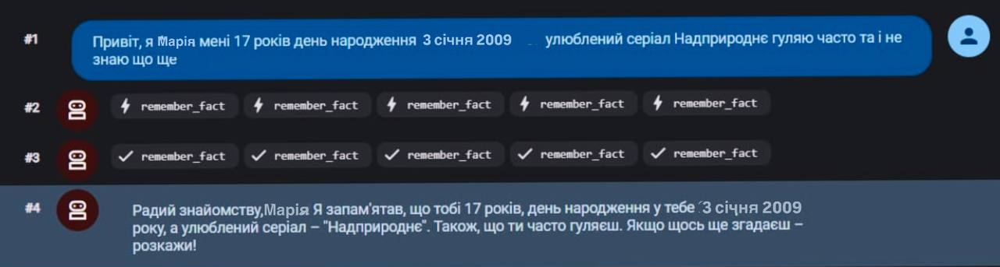

## 🔄 Workflow агенти

### Sequential (послідовний)
Виконує кроки один за одним:
1. аналіз  
2. виконання  
3. отримання результату  

📌 Перевага: чіткий контроль і логічна послідовність дій  

---

### Loop (циклічний)
Повторює дії до досягнення потрібного результату.  
Завершення відбувається через функцію `exit_loop`.

📌 Перевага: поступове покращення результату  

---

### Parallel (паралельний)
Виконує декілька задач одночасно.

📌 Перевага: швидке виконання незалежних задач  

---

## 📊 Порівняння

- **Sequential** → важливий порядок виконання  
- **Loop** → покращення результату через повторення  
- **Parallel** → економія часу  

---

## 🧪 Тестування агентів

### ⏰ Time Agent

Який час у Львові? → HH:MM:SS

### 🧮 Math Agent

5 × 10 = 50
π × 7² ≈ 153.94
3³ = 27

### 🎓 Student Helper
- пояснення тем (декоратори, list comprehension)  
- перевірка синтаксису коду  

---

## 🧠 Висновок

У ході роботи я навчилась:
- створювати AI агентів за допомогою Google ADK  
- використовувати tools (функції-інструменти)  
- налаштовувати інструкції для моделей  
- працювати з Gemini API  
- створювати агентів з пам’яттю  
- застосовувати Workflow агентів (Sequential, Loop, Parallel)  

---

## 📁 Структура проєкту

notes/06_python_agents/
├── my_first_agent/
├── math_agent/
├── student_helper/
├── creative_writer/
├── conversation_agent/
├── stateful_agent/
├── tools/
├── pyproject.toml
└── poetry.lock

---

## ⚠️ Важливо
- файл `.env` не додається в Git  
- API ключі зберігаються тільки локально  

---

## 🔗 Корисні ресурси
- Google ADK Documentation  
- Google AI Studio  
- Gemini API  
- Poetry Documentation  