# Звіт до роботи  

**Тема:** Віртуальні середовища  

**Мета роботи:** Ознайомитися з віртуальними середовищами Python, навчитися працювати з бібліотеками за допомогою pip, pipenv та poetry.  

**Виконала:** Петращук Марія
**Група:** КНк-33  
**Навчальний заклад:** Коледж інформаційних технологій НУ «Львівська політехніка»  

---

## Виконання роботи  

### 🔹 Завдання 1. Перевірка pip  

```bash
pip -V
pip --help
pip list
```

---

### 🔹 Завдання 2. Встановлення requests  

```bash
pip install requests
```

```python
import requests
print(requests.__version__)

r = requests.get('https://google.com')
print(r.status_code)
```

📸 Скріншот:  
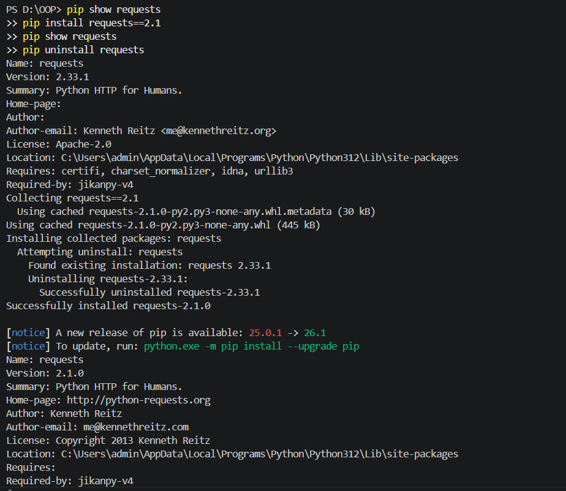

---

### 🔹 Завдання 3. Команди pip  

```bash
pip show requests
pip install requests==2.1
pip uninstall requests
```

📸 Скріншот:  
![pip]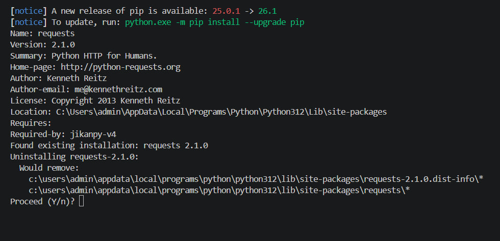

---

### 🔹 Завдання 4. Flask + jikanpy  

```bash
pip install jikanpy-v4 Flask
```

```python
from flask import Flask
from jikanpy import Jikan

jikan = Jikan()
app = Flask(__name__)

j = jikan.anime(54595, extension='episodes')

@app.route('/')
def home():
    a = ""
    for episode in j["data"]:
        a += f"<p>{episode['title']} - {episode['score']}</p>"
    return a

if __name__ == '__main__':
    app.run(debug=True)
```

📸 Скріншот:  
!
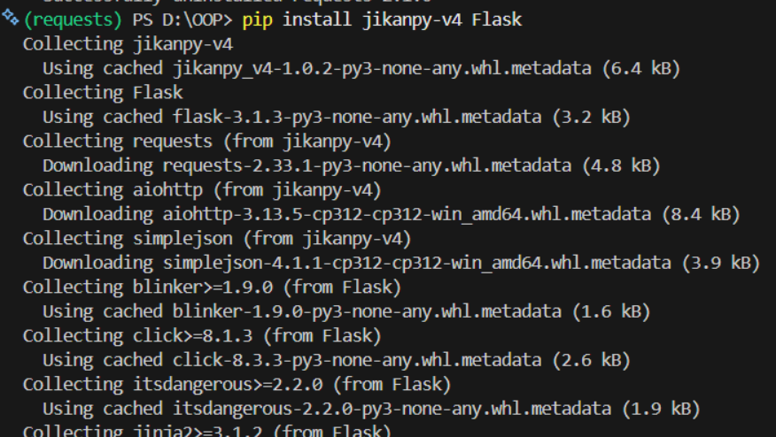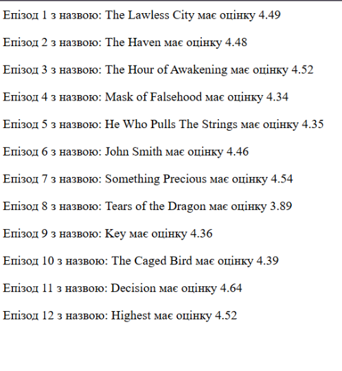

---

### 🔹 Завдання 5. VENV  

```bash
python -m venv my_env
my_env\Scripts\activate
pip install requests
deactivate
pip show requests
```

📸 Скріншот:  
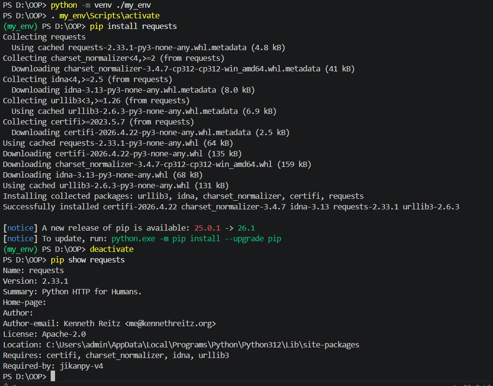

---

### 🔹 Завдання 6. .gitignore  

```text
my_env/
__pycache__/
*.pyc
.env
```

---

### 🔹 Завдання 7. pipenv  

```bash
pip install pipenv
pipenv --python 3.12
pipenv install requests
pipenv graph
```

📸 Скріншот:  
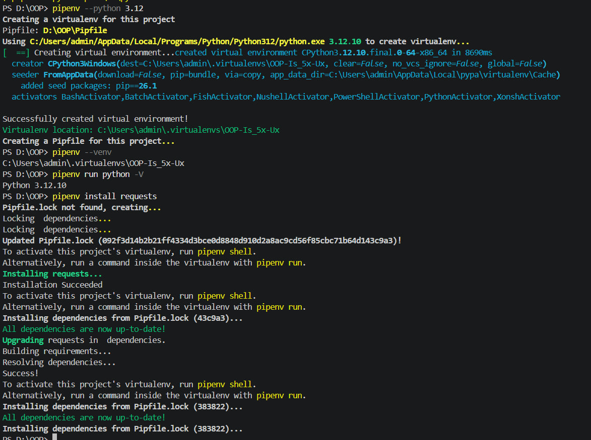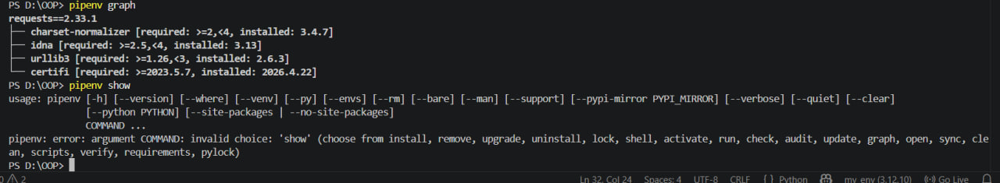

---

### 🔹 Завдання 8. Програма  

```python
import requests

response = requests.get('https://httpbin.org/')
for line in response.iter_lines():
    print(line)
```

📸 Скріншот:  
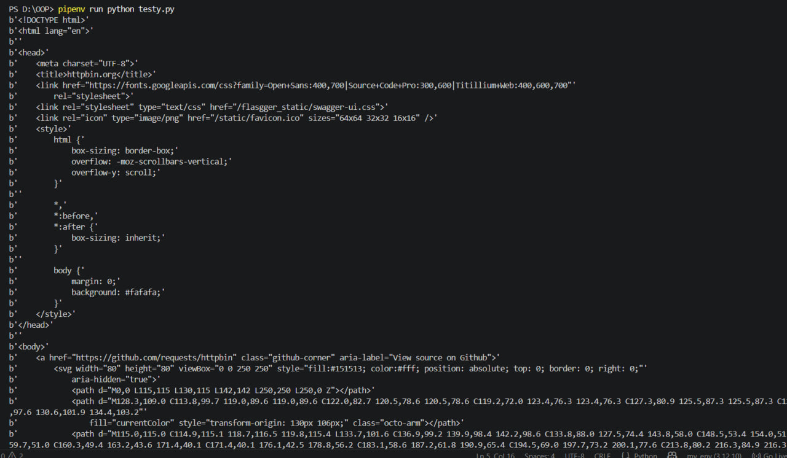

---

### 🔹 Завдання 9. flake8  

```bash
pipenv install --dev flake8
pipenv run flake8 .
```

📸 Скріншот:  
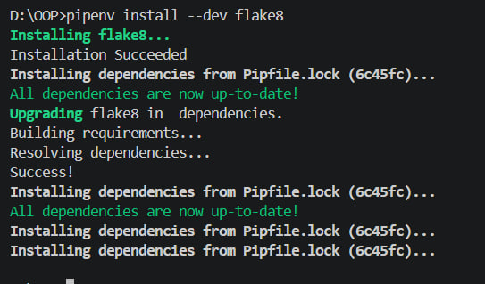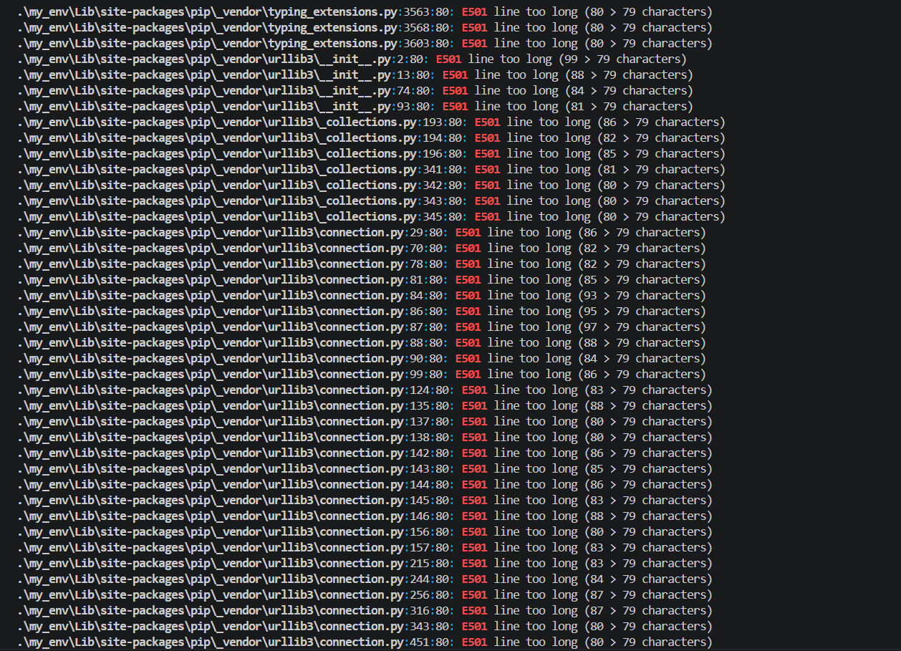
---

### 🔹 Завдання 10. Безпека  

```bash
pipenv check --scan
pipenv audit
```

📸 Скріншот:  
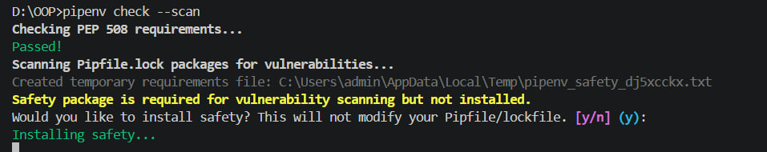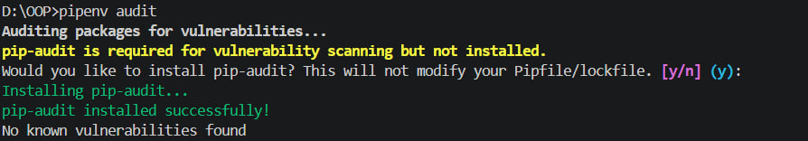
---

### 🔹 Завдання 11. .env  

```text
IT_TEST=HelloWorld
```

```python
import os
print(os.environ['IT_TEST'])
```
Результат

---

### 🔹 Завдання 12. poetry  

```bash
poetry new myproject
cd myproject
poetry add requests
poetry show
```

📸 Скріншот:  


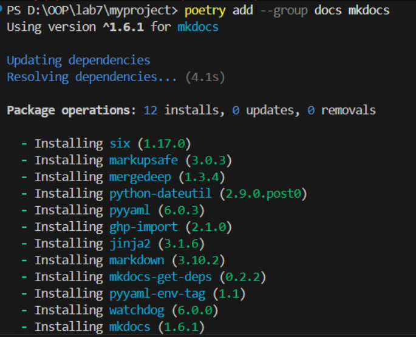
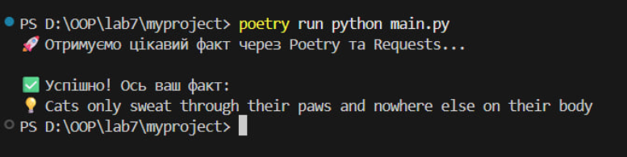
Написання коду до завдання 
```
import requests

def get_random_fact():
    # Надійне API з фактами про тварин
    url = "https://catfact.ninja/fact"
    
    print("🚀 Отримуємо цікавий факт через Poetry та Requests...")
    
    try:
        response = requests.get(url)
        response.raise_for_status()
        data = response.json()
        
        print("\n✅ Успішно! Ось ваш факт:")
        print(f"💡 {data['fact']}")
        
    except Exception as e:
        print(f"❌ Навіть це API дало збій: {e}")

if __name__ == "__main__":
    get_random_fact()
```
---

### 🔹 Завдання 13. Flask сайт  

```python
from flask import Flask
import requests

app = Flask(__name__)

def get_cat_fact():
    try:
        response = requests.get("https://catfact.ninja/fact")
        return response.json().get('fact', "Факт загубився по дорозі...")
    except:
        return "Не вдалося отримати факт."

@app.route('/')
def home():
    fact = get_cat_fact()
    return f"""
    <html>
        <head><title>Мій перший сайт на Flask</title></head>
        <body style="text-align: center; font-family: sans-serif; padding-top: 50px;">
            <h1>Вітаю! Це вебсторінка на Flask 🚀</h1>
            <p style="font-size: 1.2em; color: #555;">Ось цікавий факт, отриманий через API:</p>
            <div style="background: #f0f0f0; padding: 20px; border-radius: 10px; display: inline-block;">
                <strong>{fact}</strong>
            </div>
            <br><br>
            <a href="/">Оновити сторінку</a>
        </body>
    </html>
    """

if __name__ == "__main__":
    # Запускаємо сервер на локальному хості
    app.run(debug=True)

     
```

📸 Скріншот:  
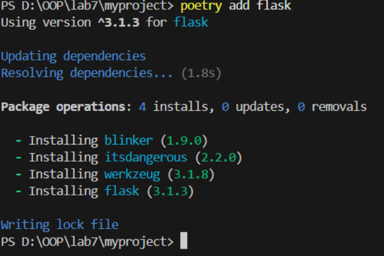
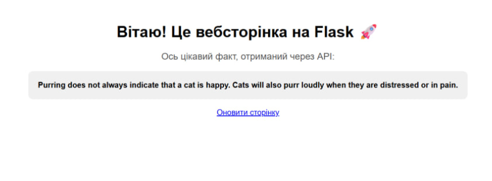
---

## Висновок  

У ході роботи я ознайомилася з віртуальними середовищами Python та навчилася створювати їх за допомогою venv, pipenv і poetry. Навчилася встановлювати бібліотеки, запускати програми та працювати з залежностями.  

Мета роботи досягнута. Всі завдання виконано, хоча виникали незначні труднощі. Такий формат роботи є зручним.