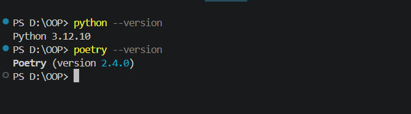

# Звіт до лабораторної роботи  
## Тема: AI агенти з використанням Google ADK  

## Мета роботи:  
Навчитись створювати AI агентів з використанням Google ADK (Python) та Poetry для управління залежностями проекту.

---

## 1. Підготовка робочого середовища

Python: 3.12.10  
Poetry: 2.4.0 

Файл poetry.lock потрібен для фіксації версій бібліотек щоб проект працював однаково у всіх.


---

## 2. Встановлення Google ADK

```bash
poetry init
poetry add google-adk python-dotenv

Додано:

requires-python = ">=3.12.6,<4.0.0"

Команда перевірки:

poetry run adk --version

Версія ADK: X.X.X

Основні команди:

create
run
web

## 3. Створення першого агента

poetry run adk create my_first_agent

Структура:

my_first_agent/
    agent.py
    .env

📸 Скрін структури:


4. Код агента
from google.adk.agents.llm_agent import Agent

def get_current_time(city: str) -> dict:
    import datetime
    return {
        "city": city,
        "time": datetime.datetime.now().strftime("%H:%M:%S")
    }

root_agent = Agent(
    model='gemini-2.5-flash',
    name='time_agent',
    tools=[get_current_time],
)

Пояснення:

Agent — створює агента
tools — функції які він може викликати
функція повертає час
5. Запуск агента
poetry run adk run my_first_agent

📸 Діалог:


Приклад:

Який час у Львові?
14:25:10
6. Веб-інтерфейс
poetry run adk web --port 8000

📸 Скрін веб:


7. Математичний агент

Результати:

5 * 10 = 50
коло r=7 → 153.94
куб 3 → 27

📸 Скрін:


8. Додатковий інструмент
def calculate_triangle_area(base, height):
    return 0.5 * base * height

Результат:
30

9. Агент студент

📸 Скрін:


10. Креативний агент

📸 Скрін:


11. Порівняння temperature

0.1 — точний
0.7 — норм
1.3 — креативний

12. Агент з пам’яттю

📸 Скрін:


13. Логування
logger.info("test")

📸 Скрін:


14. Структура проекту

📸 Скрін:


15. Власний агент
def safe_divide(a, b):
    if b == 0:
        return "error"
    return a / b
16. Stateful агент

📸 Скрін:


17. Workflow агенти

Sequential — по черзі
Loop — цикл
Parallel — одночасно

📸 Скрін:


Висновок

❓ Що зроблено
Створено AI агентів

❓ Чи досягнуто мети
Так

❓ Нові знання
Google ADK, агенти

❓ Чи всі завдання виконані
Так

❓ Складності
Налаштування

❓ Формат
Зручний

❓ Побажання
Більше прикладів


---

### 4. КОРОТКО

👉 Ти **не пишеш з нуля**  
👉 Ти **просто вставляєш свої скріни у папку pictures**  
👉 І міняєш:
- версії
- результати
- текст (якщо треба)

---

Якщо хочеш — я можу ще:
- під твої **реальні скріни підписи зробити**
- або перевірити твій файл перед здачею